# ARIA — Anticipatory Reasoning and Intelligent Assistance

ARIA is a proactive assistant that runs quietly in the background, learns per-user work patterns, and surfaces the right suggestion at the right moment.

---

## Architecture References

System architecture:



Behavior-model detail:



UI/UX reference mockups:

- [Interfaces mockup](./aria_interfaces_mockup.html)
- [Zero-budget stack mockup](./aria_free_stack.html)
- [User journey flow](./aria_user_journey_flow.html)
- [Tray popup behavior mockup](./aria_tray_popup_mockup.html)

---

## Requirements

### Functional requirements

#### Behavior modeling
- Learn per-user temporal patterns (hour/day/week rhythms) from calendar and app activity.
- Predict the next likely activity given current context.
- Detect user state: `deep_focus`, `context_switching`, `overloaded`.

#### Context fusion
- Combine: current time + calendar lookahead + open tasks + behavioral prediction.
- Re-evaluate context every ~15 minutes in the background.

#### Proactive surfacing
- Generate suggestions without being asked.
- Rank by urgency (`deadline x impact x interruptibility`).
- Gate delivery: suppress during meetings/focus and queue for the right moment.

#### Memory
- Persist episodic, semantic, and procedural memory across sessions.
- Store preferences, habits, and past suggestion outcomes.

#### Feedback loop
- Track `accepted`, `dismissed`, `ignored`, `snoozed`.
- Continuously re-weight urgency model based on outcomes.

### Non-functional requirements
- Runs mostly offline/on-device (privacy-first).
- Background daemon, not a chatbot window users must open.
- Low idle CPU footprint (periodic check loop, not constant inference).
- No paid APIs required.

---

## Interfaces (Actual Product Surfaces)

ARIA ships as three lightweight surfaces:

### 1) Desktop app (primary, required)
- Installer bundles daemon + local storage + dashboard + tray integration.
- Runs continuously in background.
- System tray icon is the persistent entry point.

### 2) Phone app (companion, optional)
- Sends coarse location context and quick tasks.
- Receives nudges when user is away from desktop.
- Connects directly to desktop over local WiFi (no cloud relay).

### 3) Tray popup (primary interaction)
- Small bottom-right popup.
- Shows only when interrupt gate allows.
- Actions: `Act`, `Snooze`, `Dismiss`.
- Auto-dismiss after 12s if ignored.
- Every interaction writes feedback to the model loop.

### Dashboard (on-demand only)
- Opened from tray icon.
- Weekly-review style surface, not a daily operational UI.
- Shows what fired, why it fired, learned patterns, and settings.

---

## Tray Popup and UX Behavior (Implementation Rules)

- Use desktop + phone companion + tray popup approach.
- If user frequently opens dashboard to operate ARIA, UX has failed.
- Default experience: install once, forget it, receive occasional high-quality nudges.

Popup behavior:
- Anchored near tray / bottom-right.
- Includes reason + urgency + one-tap actions.
- Auto-dismisses at 12 seconds and logs `ignored`.
- Suppress during deep focus, calls, active meetings, and dense interruption windows.
- Queue and re-surface when interrupt gate opens.

---

## Zero-Budget Tech Stack

Inference:
- OpenRouter free tier (`google/gemini-2.0-flash-exp:free`) for high-quality nudge wording.
- Ollama local models for offline fallback and summarization.

Memory:
- `sentence-transformers` (`all-MiniLM-L6-v2`) for on-device embeddings.
- ChromaDB for local vector memory.

Behavior model:
- Start with Markov chain / lightweight heuristics.
- Upgrade to PyTorch Geometric GNN after stable data accumulation.

Data connectors:
- Google Calendar API (free OAuth).
- ActivityWatch local API (`localhost:5600`).
- `watchdog` for notes folder updates.

Storage and runtime:
- SQLite for events, nudges, feedback, settings.
- APScheduler for periodic loops.
- FastAPI for local API + websocket.
- Electron + React for desktop UI.
- React Native / Expo for phone companion.

Target recurring cost: **0**.

---

## How to Build (Phased Plan)

### Phase 1 — Data pipeline (Week 1)
Build connectors + SQLite ingestion first.

```text
aria/
  connectors/
    google_calendar.py
    notes_watcher.py
    activity_logger.py
  storage/
    db.py
  main.py
```

Goal: Real events/note/activity data flowing into SQLite. No AI yet.

### Phase 2 — Dumb context engine (Week 2)
- Rule: meeting in <30 min and no prep note -> nudge.
- Rule: 3+ meetings today -> high load handling.
- OS notifications via `notify-py`.

Goal: Working product before advanced modeling.

### Phase 3 — Memory layer (Week 3)
- Embed notes/tasks/events using `all-MiniLM-L6-v2`.
- Store vectors in ChromaDB persistent store.
- Use Ollama to extract semantic facts into memory/habits.

### Phase 4 — Behavior model (Week 4-5)
- Start: Markov `(hour_bucket, day_of_week) -> next_activity`.
- Upgrade: GNN once data is sufficient and pipeline is stable.
- Fuse behavior output into context engine.

### Phase 5 — LLM suggestion generator (Week 5-6)
- Replace hardcoded nudge text with OpenRouter generation.
- Keep prompts compact and privacy-safe.
- Continue local fallback path.

### Phase 6 — Dashboard + feedback loop (Week 6-7)
- Build complete dashboard.
- Wire accept/dismiss/snooze to SQLite feedback.
- Re-weight urgency model based on outcomes.

---

## One Thing to Nail First

Install **ActivityWatch** before anything else.

- Free, open source, local-first.
- Provides core behavior stream via `localhost:5600`.
- Without real activity data, the rhythm model cannot learn.

Link: [ActivityWatch](https://activitywatch.net)

---

## Actual Implementation Status

Current repository status is tracked in:

- `ARIA_WORKFLOW_CHECKLIST.md` (phase-by-phase done/partial/pending + test checklist)
- `ARIA_PRD.md` (full product requirements and architecture contract)